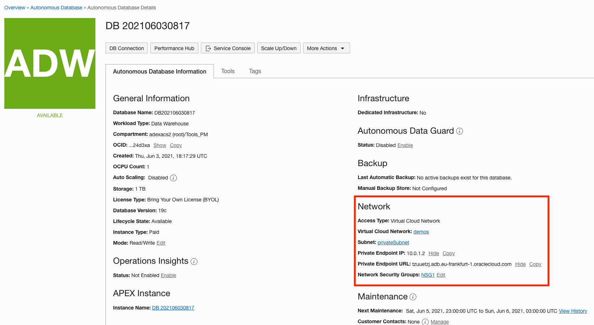
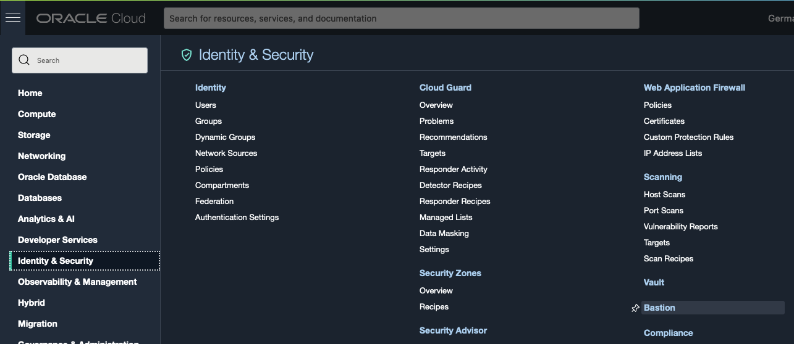
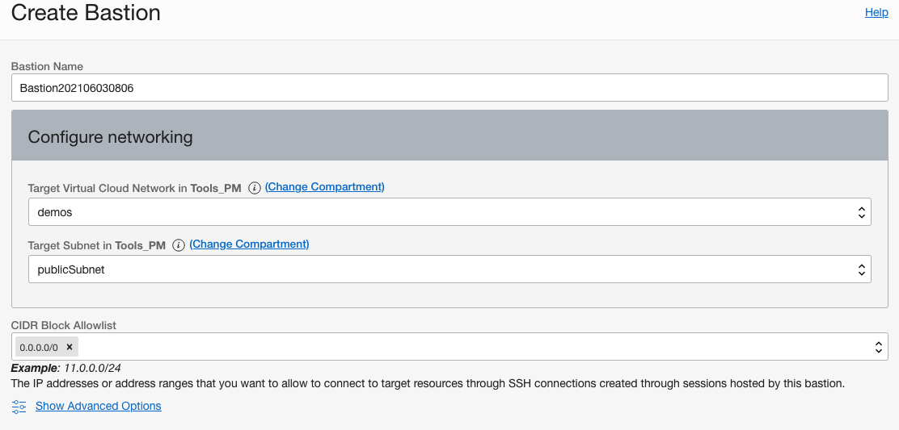
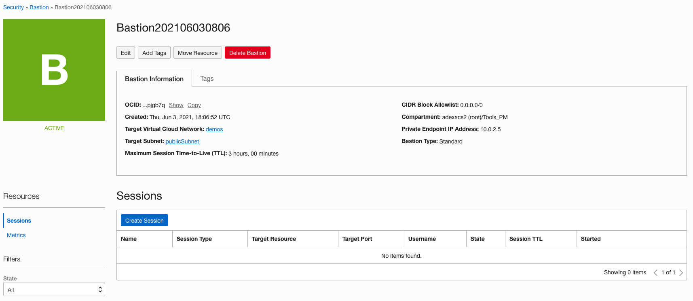
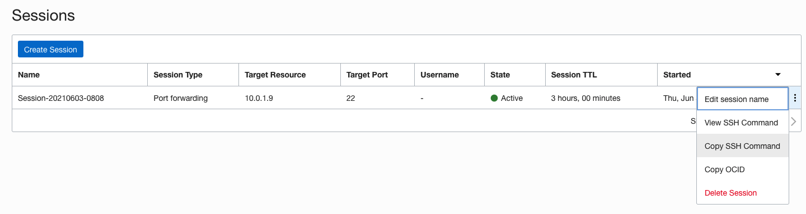
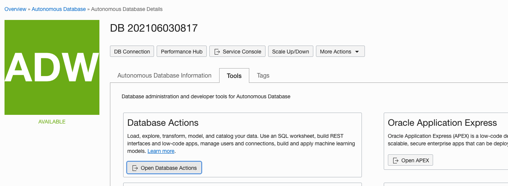
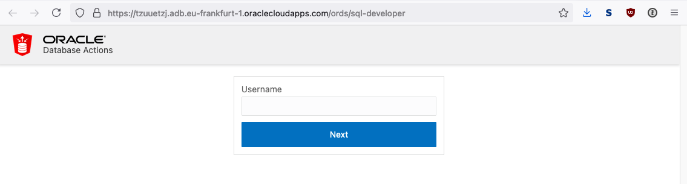

# Using Bastion as a Service for ADB/DBCS instances

First we need some information from the ADB using the private endpoint. On the details page of the ADB using PE, find the Network section.



Make note of the Private Endpoint IP and the Private Endpoint URL.

Here our IP is 10.0.1.2 and the URL is tzuuetzj.adb.eu-frankfurt-1.oraclecloud.com


Create a bastion in OCI via the OCI Web Console at Identity & Security → Bastion



Click the Create Bastion button, use a public subnet and allow access from a CIDR block



View the details of the bastion and click the Create Session button



In the Create Session slider, set:

**Session Type:** SSH port forwarding session

****IP Address:** IP of the ADB instance using a private endpoint (ie. 10.0.1.2) Remember, we noted this at the beginning when looking at our ADB Details page.

**Port**: 1522 for SQL*Net access or 443 for HTTPS access (although the following screenshots show 22)

**Add SSH Key:** Provide your own or use the generated one

When done, click the Create Session button


Once the session is created, use the pop out menu and select Copy SSH Command



The SSH Command will look similar to the following:
```
ssh -i <privateKey> -N -L <localPort>:10.0.1.2:22 -p 22 ocid1.bastionsession.oc1.eu-frankfurt-1.amaaaaaau3i6vkyaj347383023098230-9adsfhbzdxc09898h23r@host.bastion.eu-frankfurt-1.oci.oraclecloud.com
```
Change **<privateKey>** to be the matching private key to the public key you created the session with and change **<localPort>** to be the port on your local machine you want to use. If using 443, you will have to run the command as an administrator on most unix/linux based systems but.......

Before you run the command, you will need to alter your hosts file (/etc/hosts on unix/linux or C:\Windows\System32\Drivers\etc\hosts for Windows). Remember the Private Endpoint URL we noted on the ADB details page. Remember, your hostname will be different.

**For SQL*Net Access:**

Add the following entry if you want to connect via SQL*net

127.0.0.1 tzuuetzj.adb.eu-frankfurt-1.oraclecloud.com

you may have to comment out localhost here

127.0.0.1 tzuuetzj.adb.eu-frankfurt-1.oraclecloud.com #localhost

Hence with port 1522 (and ideally localPort equals to 1522 thus you don't need to change the wallet content, specifically the tnsnames.ora):
```
ssh -i <privateKey> -N -L 1522:10.0.1.2:1522 -p 22 ocid1.bastionsession.oc1.eu-frankfurt-1.amaaaaaau3i6vkyaj347383023098230-9adsfhbzdxc09898h23r@host.bastion.eu-frankfurt-1.oci.oraclecloud.com
```
  
**For HTTPS Access:**

Add the following entry if you want to connect via HTTPS

127.0.0.1 tzuuetzj.adb.eu-frankfurt-1.oraclecloudapps.com

you may have to comment out localhost here

127.0.0.1 tzuuetzj.adb.eu-frankfurt-1.oraclecloudapps.com #localhost

Hence with port 443 (and ideally localPort equals to 443 thus you don't need to modify ORDS, SQL Developer Web... URLs):
```
ssh -i <privateKey> -N -L 443:10.0.1.2:443 -p 22 ocid1.bastionsession.oc1.eu-frankfurt-1.amaaaaaau3i6vkyaj347383023098230-9adsfhbzdxc09898h23r@host.bastion.eu-frankfurt-1.oci.oraclecloud.com
```
  
You can now go ahead and connect via SQL*Net as you would an ADB on a public IP with the wallet.

If using HTTPS, you can get the URL via the tools subtab on the ADB details page.



Here our URL is https://tzuuetzj.adb.eu-frankfurt-1.oraclecloudapps.com/ords/sql-developer

We can put that in a browser to access Database Actions


