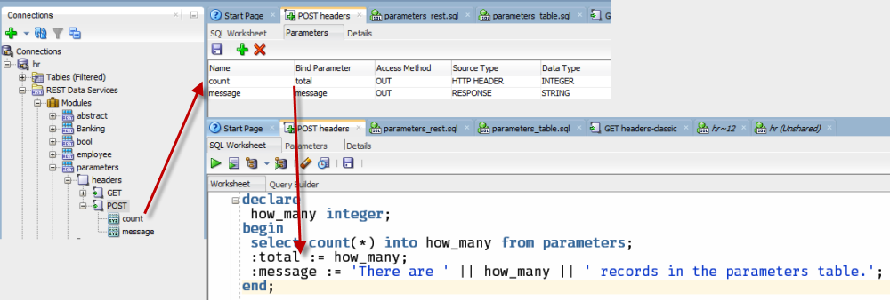

# How to pass a value to the HTTP Response Header
Instead of showing how to reference a value passed in via the HTTP Request Header, this will show how to assign a value to parameter included in the HTTP response header.

HTTP Response Headers are not available for GET requests, so this example will be demonstrated via a POST handler. 

This will demonstrate how to:

- Assign a value from the PL/SQL block to a parameter on the HTTP Response Header
- Assign a value from the PL/SQL block to the Response Body itself
 
*Note: the purpose of this example is not to deal with the response body specifically, but we show it briefly here as a convenience.*

POST handlers are serviced by PL/SQL blocks. HTTP POST is generally used to add an object to a resource. This would be accomplished by running an INSERT statement. For this example, we are merely sending data back on the response header - it is not meant to be indicative of the typical POST handler. 



```
curl -X POST \
  http://localhost:8080/ords/hr/parameters/headers \
  -H 'cache-control: no-cache' 
```

# And the response headers:

    access-control-allow-credentials →true
    access-control-allow-origin →chrome-extension://aicmkgpgakddgnaphhhpliifpcfhicfo
    access-control-expose-headers →count, Content-Type, Access-Control-Allow-Origin, Access-Control-Allow-Credentials, Vary
    content-type →application/json
    count →4
    date →Fri, 19 Jan 2018 20:16:48 GMT
    transfer-encoding →chunked
    vary →Origin

Note that we passed back the number of records in the table (4) via the bind *:total*, which is mapped to the HTTP Response Header element, *count*.

# And the response body:

    {"message":"There are 4 records in the parameters table."}

Since we are already looking at a POST handler, you can see it's very easy to put together the RESPONSE body. 

Next Example: [Passing a value to the GET Handler code using URL Parameters](Example3.md).