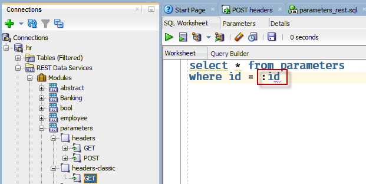

# How to Pass a value to the GET Handler code using URL Parameters

Instead of coding the parameter into the URI definition itself, this will show how to pass values via the URL, e.g. 

*http://localhost:8080/ords/hr/parameters/headers-classic?id=4*

This is a very straightforward definition. You do not need to code the URI pattern in advance knowing what parameters you want to pass.

In other words, the RESTful Service definition is not explicitly aware of the parameter, but you can reference these values in the GET handler SQL block.

Note that this would not generally be considered a REST best practice.




```
curl -X GET \
  'http://localhost:8080/ords/hr/parameters/headers-classic?id=4' \
  -H 'cache-control: no-cache' \
```

And the Response:

    {
    "items": [
    {
    "id": 4,
    "words": "audios",
    "when": "2018-01-19T20:22:49Z",
    "age": 63
    }
    ],
    "hasMore": false,
    "limit": 25,
    "offset": 0,
    "count": 1,
    "links": [
    {
    "rel": "self",
    "href": "http://localhost:8080/ords/hr/parameters/headers-classic?id=4"
    },
    {
    "rel": "describedby",
    "href": "http://localhost:8080/ords/hr/metadata-catalog/parameters/item"
    },
    {
    "rel": "first",
    "href": "http://localhost:8080/ords/hr/parameters/headers-classic?id=4"
    }
    ]
    }

We asked for record '4' and were returned record '4.' Note you can pass as many parameters as you would like via the URL. URL encoding will be required if you need to send reserved characters, spaces, etc. 

Next Example: [Building one or more parameters into the URI](Example4.md). 