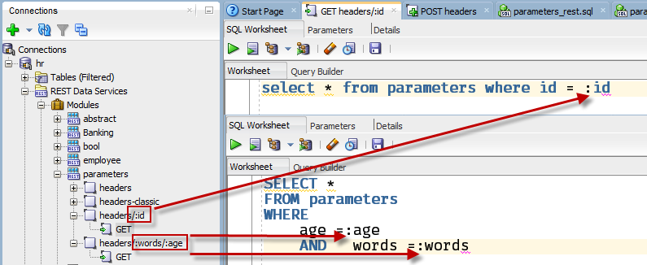

# How to build one or more parameters into the URI

As opposed to the previous example, we will now hard code the one or more parameters into the template pattern itself.

The parameters do not need to be declared, as they are coming in via the request URI, and not the request header keys.



For ORDS to recognize the requests, each template must be defined separately. 

**Scenario 1: Passing a single parameter**

```
curl -X GET \
  http://localhost:8080/ords/hr/parameters/headers/3 \
  -H 'cache-control: no-cache' \
```

ORDS recognizes this route pattern and is able to navigate appropriate code block, returning the records whose ID=3.

And the Response:

    {
    "items": [
    {
    "id": 3,
    "words": "hola",
    "when": "2018-01-19T20:19:40Z",
    "age": 12
    }
    ],
    "hasMore": false,
    "limit": 25,
    "offset": 0,
    "count": 1,
    "links": [
    {
    "rel": "self",
    "href": "http://localhost:8080/ords/hr/parameters/headers/3"
    },
    {
    "rel": "describedby",
    "href": "http://localhost:8080/ords/hr/metadata-catalog/parameters/headers/item"
    },
    {
    "rel": "first",
    "href": "http://localhost:8080/ords/hr/parameters/headers/3"
    }
    ]
    }


**Scenario 2: Passing 2 parameters**

```
curl -X GET \
  http://localhost:8080/ords/hr/parameters/headers/audios/63 \
  -H 'cache-control: no-cache' \
```


ORDS recognizes this route pattern and is able to navigate appropriate code block, returning the records whose words = 'audios' and age = 63.

And the Response:

    {
    "items": [
    {
    "id": 4,
    "words": "audios",
    "when": "2018-01-19T20:22:49Z",
    "age": 63
    }
    ],
    "hasMore": false,
    "limit": 25,
    "offset": 0,
    "count": 1,
    "links": [
    {
    "rel": "self",
    "href": "http://localhost:8080/ords/hr/parameters/headers/audios/63"
    },
    {
    "rel": "describedby",
    "href": "http://localhost:8080/ords/hr/metadata-catalog/parameters/headers/audios/item"
    },
    {
    "rel": "first",
    "href": "http://localhost:8080/ords/hr/parameters/headers/audios/63"
    }
    ]
    }

## ORDS Also supports /{id}/{id2} notation ##
However, we recommend the more modern /:id/:id2 nation and do not guarantee continuing support.