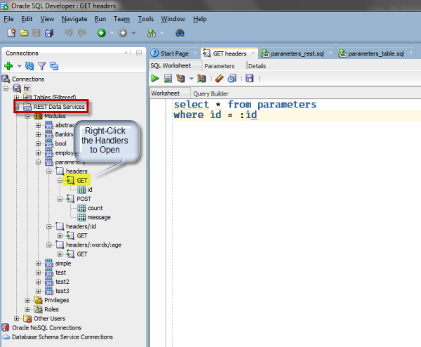
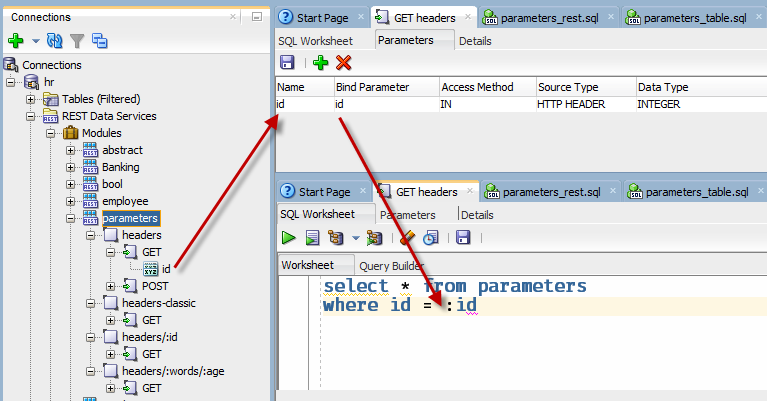

# ords-demo-parameters
Build scripts to demonstrate working with parameters in your Oracle REST Data Services (ORDS) RESTful Services.

This will demonstrate how to:

- Read a value in your GET handler SQL block from the request header 
- Return a value via HTTP Header and Response Body via your POST handler anonymous block
- Read a value in your GET handler SQL block from the URI?var=value 
- Read a value in your GET handler SQL block from the URI/:value or /:value1/:value2


# Prerequisites

You will need at least a browser to work with the simple GET examples. You will also need a REST client such as Postman or cURL.

Download from OTN: ORDS & Oracle SQL Developer

Required: [Download ORDS](http://www.oracle.com/technetwork/developer-tools/rest-data-services/downloads/index.html)

Required: [Download SQLDev](http://www.oracle.com/technetwork/developer-tools/sql-developer/downloads/index.html)

Required: Install ORDS, configure for an Oracle Database (11gR2 or higher), REST enable a schema.

# Table of Contents

- Installation and Example 1
- [Example 2: passing a value to the HTTP Header Response (and Body)](Example2.md)
- [Example 3: passing a value to the GET Handler code using URL Parameters](Example3.md)
- [Example 4: building one or more parameters into the URI](Example4.md)


# 'Installation' and Example 1

Using SQL Developer, open the two .SQL files in this project directory, and execute on a connection to the REST enabled schema.

The parameters-rest.sql file is commented to show how the ORDS PL/SQL API builds the Module, Templates, and Handlers. 

After successful execution, you will have a PARAMETERS table, and a PARAMETERS RESTful Services Module.



# Scenario 1: Getting a record from the PARAMETERS table by passing an ID via the HTTP GET Header 

The URLs shown assume that ORDS is running on the local machine via port 8080, and that the REST enabled schema is HR.

Example 1: Pulling a value off the request header.
  
```
curl -X GET \
  http://localhost:8080/ords/hr/parameters/headers \
  -H 'cache-control: no-cache' \
  -H 'id: 2' 
```

*For example, how can we reference the value of ID passed via cURL in the database code?*



In the associated GET handler code block, as shown in the image above, the value from the HTTP header is declared as part of the RESTful Service in the Parameters page. The 'name' is the HTTP request header Key name. The Bind Parameter value is how the value will be references in the SQL statement. It is being declared as an INTEGER so it will be treated in the query statement as a number. 

Running the request with a ID value of 2, the response from ORDS will be similar to the following:

    {
    "items": [
    {
    "id": 2,
    "words": "goodbye",
    "when": "2018-01-19T20:17:32Z",
    "age": 5
    }
    ],
    "hasMore": false,
    "limit": 25,
    "offset": 0,
    "count": 1,
    "links": [
    {
    "rel": "self",
    "href": "http://localhost:8080/ords/hr/parameters/headers"
    },
    {
    "rel": "edit",
    "href": "http://localhost:8080/ords/hr/parameters/headers"
    },
    {
    "rel": "describedby",
    "href": "http://localhost:8080/ords/hr/metadata-catalog/parameters/item"
    },
    {
    "rel": "first",
    "href": "http://localhost:8080/ords/hr/parameters/headers"
    }
    ]
    }

Next Example: [Passing a value to the HTTP Header Response (and Body)](Example2.md).