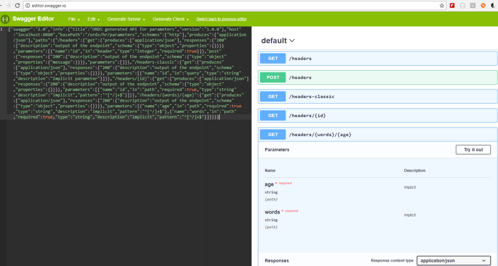

# ords-sql-examples
Scripts that demonstrate RESTful Services with Oracle REST Data Services (ORDS).

We also have a set of examples for the REST Enabled SQL feature [here](https://github.com/oracle/oracle-db-tools/tree/master/ords/rest-sql). 

# Prerequisites

You will need at least a browser to work with the simple GET examples. You will also need a REST client such as Postman or cURL.

Download from OTN: ORDS & Oracle SQL Developer

Required: [Download ORDS](http://www.oracle.com/technetwork/developer-tools/rest-data-services/downloads/index.html)

Required: [Download SQLDev](http://www.oracle.com/technetwork/developer-tools/sql-developer/downloads/index.html)

Required: Install ORDS, configure for an Oracle Database (11gR2 or higher), REST enable a schema.

# REST Enabling a Schema

RESTful Services are defined in the schema from which the services will run. For example, a service mapped to /ords/hr/ will run as the HR user, therefore inheriting the privileges defined for that Oracle user account.

This code sample will REST enable the HR schema, therefore allowing RESTful Services to be defined in the HR schema, and for those said services to be executed as the HR user.

    BEGIN
     ORDS.ENABLE_SCHEMA(p_enabled => TRUE,
                       p_schema => 'HR',
                       p_url_mapping_type => 'BASE_PATH',
                       p_url_mapping_pattern => 'hr',
                       p_auto_rest_auth => FALSE);

     commit; 
    END;

To access services on this REST enabled schema, you would use this URI pattern to get started:

*https://host:port/ords/hr* -- where 'hr' is the `p_url_mapping_pattern` value.

To access a list of the available services on a schema, use the /metadata-catalog/ endpoint:

*https://host:port:/ords/hr/metadata-catalog/*

This endpoint returns a JSON document. Each RESTful Services module also includes a */open-api-catalog/* endpoint which supports the Open API 2.0 (Swagger) Spec.

# On Security 

For simplicity, many of the examples here are presented unsecured. This is not recommended for production deployments. ORDS supports many authentication schemes, including OAuth2 and first party auth, and we plan on delivering example scenarios to showcase securing your services specifically. 