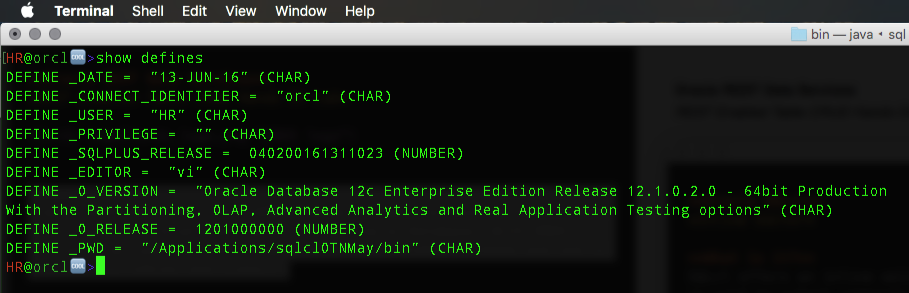
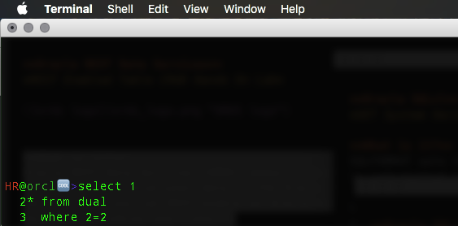

**Oracle SQLcl**  
*Inline Editor*

**What is it?**  
SQLcl offers an inline editor. The SQLcl command prompt is used to submit commands, queries, and scripts to be executed.

The input can be edited, inline, i.e. without requiring sending the buffer contents to a 3rd party editor such as notepad or vi. 

The DEFINE variable _EDITOR determines which editor to use in SQLcl when the 'edit' command is issued. To set it to the inline editor, use a value of "inline" To see the list of current DEFINEs in SQLcl, use "show defines"

 

*Usage:*

The inline editor is always available regardless of the current DEFINE _EDITOR value. To invoke it, simply use the keyboard arrow keys.

The cursor can be moved within the contents of the buffer by either using the arrow keys or with a series of ctrl key sequences.

To change the first characters of the current line, use the left arrow to move the cursor to the desired cursor position. New characters are inserted at the current cursor position.

To change the current line position, use the up or down arrow key to move up or down a line. The current line in the buffer is marked with a '*' character in the editor gutter.

When moving a line up or down in the editor, be sure to first move at least one cursor position left. This will put the the editor in edit mode and prevent the up or down arrow key from being interpreted as a request to replace the buffer contents with the SQL History contents.

Invoking the inline editor will also 'jump' the buffer contents to the bottom of your screen. This gives SQLcl a known amount of workspace in your shell window to facilitate the display of however many lines are in your buffer.

**Ctrl Key Navigation**

Ctrl + R - Immediately run the current buffer

Ctrl + W - Go to the top of the buffer (first line, first character)

Ctrl + S - Go to the bottom of the buffer (last line, last character)

Ctrl + A - Go to the start of the current line

Ctrl + E - Go to the end of the current line

