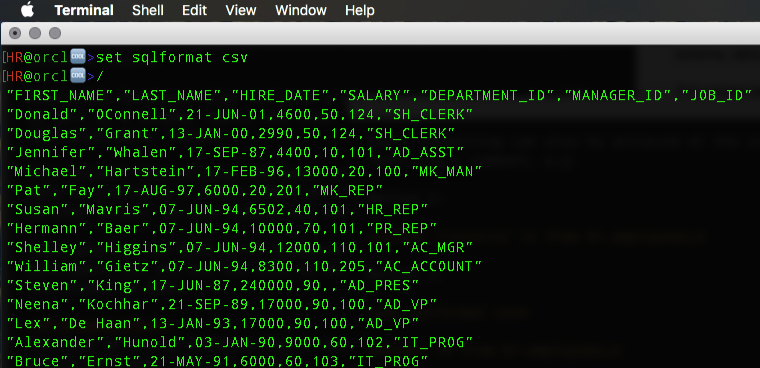
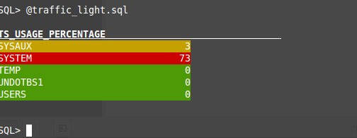

**Oracle SQLcl**  
*SET System Variables - SQLFORMAT*

**What is it?**  
SQLFORMAT sets the query response format. The default is unformatted query results via the NULL setting.

*Usage:*

SET SQLFORMAT { csv, delimited, html,xml,json,ansiconsole,insert,loader,fixed,default} 

The available SQLFORMAT names are case-sensitive.

Query formatting can also be achieved at the statement level via a comment, e.g.

Method 1:

*select /\*csv\*/ \* from hr.employees;*

Method 2:

*set sqlformat csv*

*select \* from hr.employees;*

Both will return the data in the hr.employees table as comma separated values (CSV).

**Additional Notes**

Delimited - The delimiter character and string enclosures can be defined as additional arguments, e.g.

set SQLFORMAT delimited ; " " -- where the first argument sets the delimiter character, the second defines the left string enclosure, and the third defines the right string enclosure.

Example:

~~~
HR@orcl🆒 >set sqlformat delimited || ' '
HR@orcl🆒 >select 1,2,3, 'abc' from dual;
'1'||'2'||'3'||''ABC''
1||2||3||'abc'
~~~

Ansiconsole - This format has each page of SQL statement results measured and best-fit based on the size of the editor window. In addition, you can use escape sequences to decorate the text and format numbers.

Decorating text, e.g. coloring, bolding, blinking, italicizing, etc, can be done via the Jansi project on GitHub. A full set of Docs and exmples can be found [here](https://github.com/fusesource/jansi/blob/master/jansi/src/main/java/org/fusesource/jansi/Ansi.java).

Example:

~~~
set sqlformat ansiconsole
with ts_details as
(
    select rpad(tablespace_name,30, ' ')||' '||lpad(floor(used_percent), 3, ' ') as ts_line,
        used_percent
    from dba_tablespace_usage_metrics
)
select
    case
        when used_percent > 70 then '@|bg_red '||ts_line||'|@'
        when used_percent < 1 then '@|bg_green '||ts_line||'|@'
        else '@|bg_yellow '||ts_line||'|@'
    end as ts_usage_percentage
from ts_details
/
~~~

Formatting numbers is accomplished via the Java Class DecimalFormat. A full set of Docs and examples can be found [here](https://docs.oracle.com/javase/7/docs/api/java/text/DecimalFormat.html). 

Example:

~~~
HR@orcl🆒 >set sqlformat ansiconsole ##.##E00
HR@orcl🆒 >select 1234567890 from dual;

1234567890
-----------------
12.35E08
~~~

