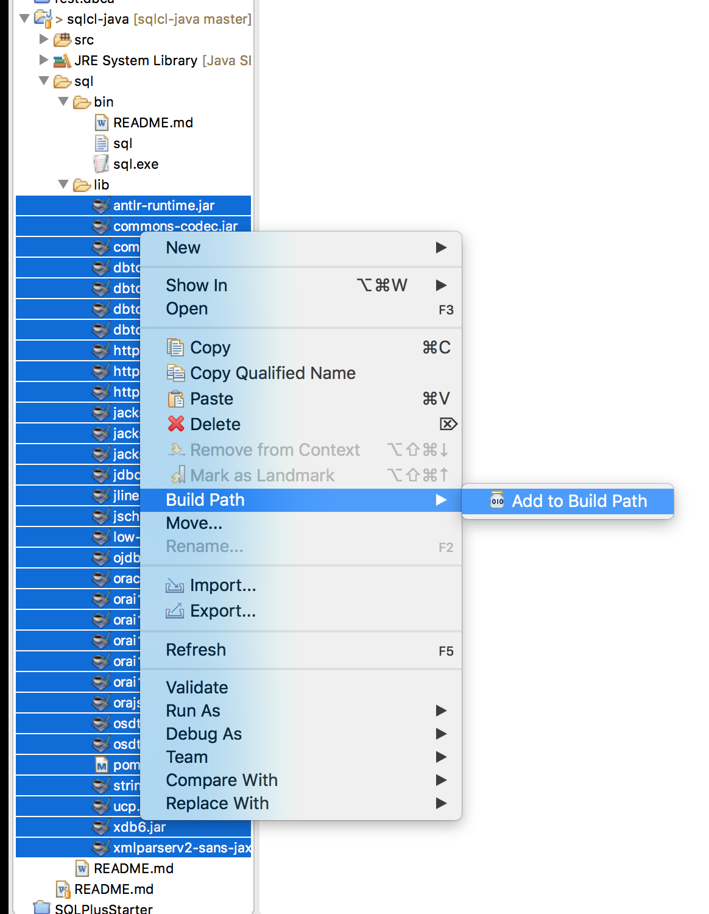

# sqlcl-java

This repository is a few examples of how to use [Oracle SQLcl](http://www.oracle.com/technetwork/developer-tools/sqlcl/overview/index.html) as a Java library.

# Env / Eclipse Setup

1. Download SQLcl
2. Unzip SQLcl
3. Add sql/lib/* files to the classpath

# 

# Examples

## Run Entire script
This example uses the @myfile 'normal' sqlcl / sqlplus syntax to run and entire script. 

[RunMyScript](src/RunMyScript.java)

## ParseScript and Execute
This is an example of parsing a file with the SQLcl script parser. Then iterating over the array of commands to execute and detect errors to be handled.

[ParseScriptRunOneAtATime.java](src/ParseScriptRunOneAtATime.java)

> Only 0 rows currently supported in a script resultsno rows selected
> 
> Table KLRICE_TEST created.
> 
> 
> 1 row inserted.
> 
> 
> 1 row inserted.
> 
> 
> 1 row inserted.
> 
> Only 0 rows currently supported in a script resultsno rows selected
> 
> Rollback complete.
> 
> no rows selected
> 
> Table KLRICE_TEST dropped.
